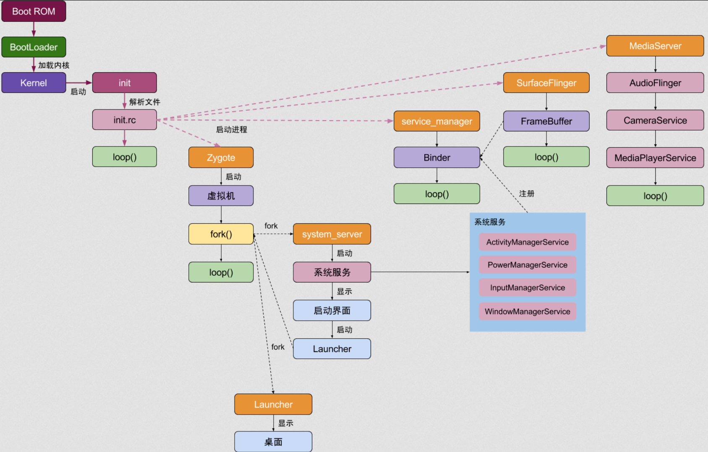

Android系统启动流程图如下：

第一阶段：设备上电后，首先会从处理器片上ROM的启动引导代码开始执行，ROM会寻找Bootloader代码，并加载到内存。

第二阶段：Bootloader开始执行，首先负责完成硬件的初始化，然后找到Linux内核代码，并加载到内存。

第三阶段：Linux内核开始启动，初始化各种软硬件环境，加载驱动程序，挂载根文件系统，并执行init程序，由此启动Android。Android系统以及各大Linux的发行版，他们的Linux内核部分启动过程都是差不多的，他们之间最大的区别就在于init程序的不同，因为init程序决定了系统在启动过程中，究竟会启动哪些守护进程和服务，以及呈现出怎样的一个用户UI界面。因此，init程序是Android启动过程中最核心的程序。对应的代码位于：system/core/init/init.c。init程序最核心的工作主要有3点：
- （1）创建和挂载一些系统目录或者设备节点，设置权限，如：/dev，/proc，/sys等。
- （2）解析init.rc和init.\<hardware\>.rc，并启动属性服务，以及一系列的服务和进程。
- （3）显示boot logo，默认是“Android”字样。

Android系统的启动最重要的过程也就是各个系统服务的启动，因为系统所有的功能都是依赖这些服务来完成的，比如启动应用程序，拨打电话，使用WIFI或者蓝牙，播放音视频等等。这些服务包含2部分，一部分是本地服务，另一部分是Android服务，所有的这些服务都会向ServiceManager进程注册，由它统一管理。
- 本地服务：本地服务是指运行在C++层的系统守护进程，一部分本地服务是init进程直接启动的，它们定义在init.rc脚本和init.\<hardware\>.rc中；还有一部分本地服务，是由这些本地服务进一步创建的，如mediaserver服务会启动AudioFlinger，MediaPlayerService，以及 CameraService等本地服务。
- Android服务：又称为系统服务，Android服务是指运行在Dalvik虚拟机进程中的服务，init进程会执行app_process程序，创建Zygote进程，它是Android系统最重要的进程，所有后续的Android应用程序都是由它fork出来的。Zygote进程会首先fork出“SystemServer”进程，“SystemServer”进程的全部任务就是将所有的Android核心服务启动起来，这些服务主要包括：
  - ActivityManagerService：Manages acitvities life cycle and new service
  - WindowManagerService：Manages all the window manipulations (like input events, orientation)
  - DisplayManagerService: Manages display properties
  - PackageManagerService：Manages application packages handling (install, uninstall, upgrade, permissions)
  - InputManagerService：Handles input devices and key layouts
  - PowerManagerService：Handles power management while Android's different modes (lock mode, sleep mode, adjust mode)
  - NotificationManagerService：Manages all notifications
  - LocationManagerService：Manages location providers
  - ConnectivityService：Monitors and handles network connection state change
  - AlermManagerService：Used to schedule the user applications to be run at feature

第四阶段：服务启动完成后，将由ActivityManagerService来启动HomeActivity，也就是Launcher，至此，Android系统就正式启动完成。
