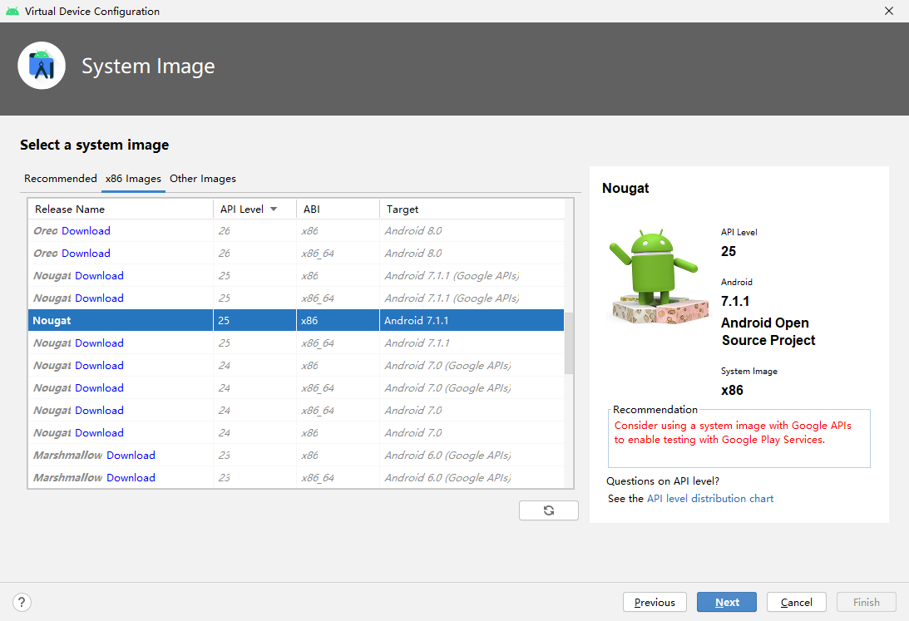
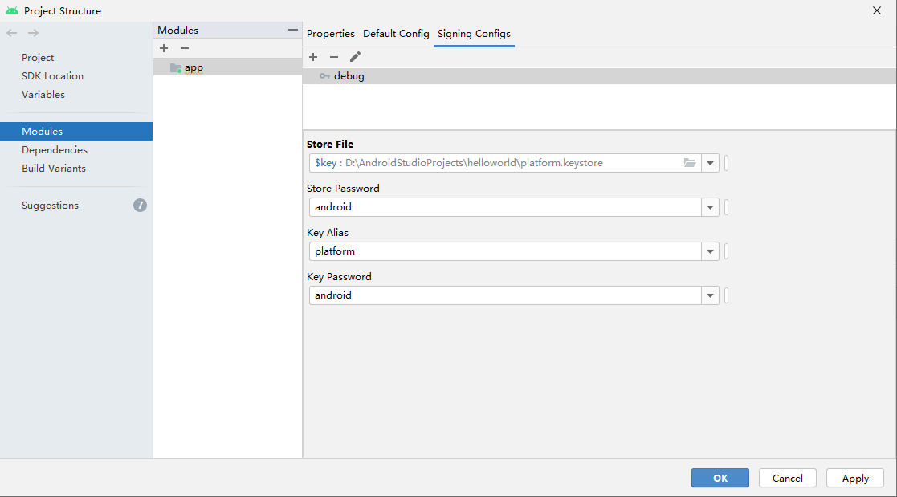
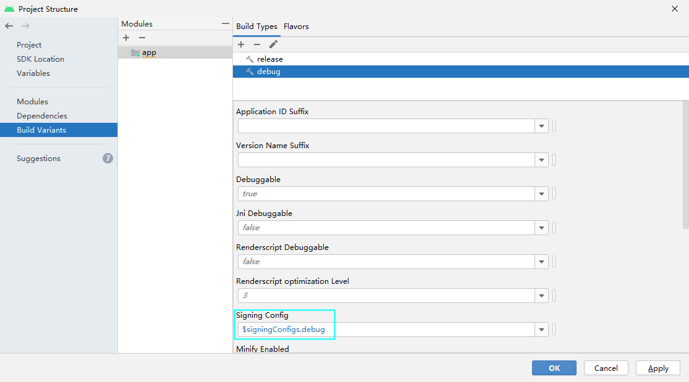

### System App
在 AndroidManifest.xml 的 <manifest> 标签中配置 android:sharedUserId="android.uid.system" 属性，这样的应用我们称为系统应用（System App）。

这种 App 如果直接在模拟器中运行会报错：
```text
Installation did not succeed.
The application could not be installed: INSTALL_FAILED_SHARED_USER_INCOMPATIBLE
```
这是由于使用了 sharedUserId 后，多个应用使用不同的签名造成的。换句话说，要想使 System App 成功安装，则需要和系统应用一样使用系统签名。


### 模拟器选择
想要让打了系统签名后的App能正常运行到 Android Studio 的模拟器中，首先要确保模拟器不是带 Google APIs 的。打开AVD我们可以看到：



如图上所示， 可以看到target那里，有的后面有个(Google APIs)。 像这种就不行， 即使你弄了对应的平台签名也无法安装上去。因为这种带 Google APIs 的， 用的系统签名和你在 AOSP 找的 platform.pk8 和 platform.x509.pem 文件生成的系统签名是不一样的。

而不带 (Google APIs) 的 image，我们可以看到右侧有一句说明：Android Open Source Project，像这种镜像我们就可以通过 AOSP 来获取 platform.pk8 和 platform.x509.pem 文件。

### 生成系统签名
首先我们要拿到对应安卓系统的 platform.pk8 和 platform.x509.pem文件，文件路径在 /build/target/product/security/ 目录下。这两个文件可以从对应版本的 AOSP 中获取，也可以从各大在线阅读 AOSP 代码的网站中获取：
- https://github.com/aosp-mirror/platform_build
- http://androidxref.com/
- http://aospxref.com/
- https://www.androidos.net.cn/sourcecode

然后获取 keytool-importkeypair 工具
- https://github.com/getfatday/keytool-importkeypair

值得注意的是 keytool-importkeypair 需要运行在 Linux 环境中

最后使用如下命令生成系统签名
```
./keytool-importkeypair -k ./platform.keystore -p android -pk8 platform.pk8 -cert platform.x509.pem -alias platform
```
生成的系统签名，名称为 platform.keystore ， 它的账号密码如下：
|prop|value|
|--|--|
|keyAlias|platform|
|keyPassword|android|
|storePassword|android|

### Android Studio 配置系统签名
File ---> Project Structure ---> Modules ---> Signing Configs 中新建一条签名的信息，包含签名的路径，签名的账户密码。



然后在 Project Structure ---> Build Variants ---> Build Types 中设置  Signing Configs 的值，保存即可。



配置完成后，我们可以在 build.gradle 中看到相应的 signingConfig 配置，这样就使 System App 可以直接运 Android Studio 模拟器中了。
