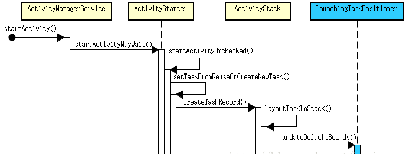
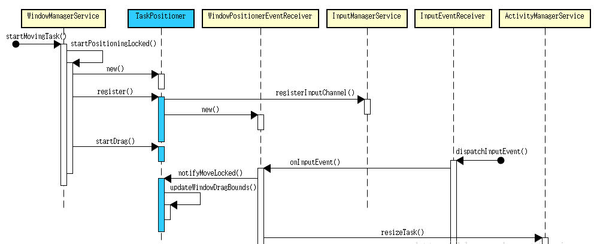
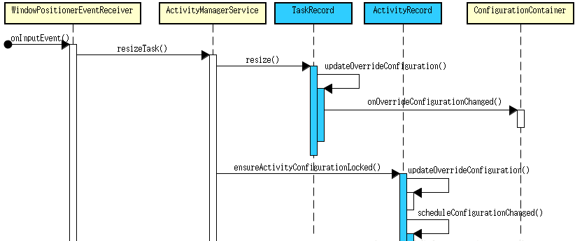

Android系统多窗口主要有三种模式，实现多窗口的核心思想是应用分栈和设置栈边界：

- Split-Screen Mode: 分屏模式。
- Freeform Mode 自由模式：类似于Windows的窗口模式。
- Picture In Picture Mode：画中画模式（PIP）。

## 栈
Android原生多窗口是多Stack方案，即存在多个ActivityStack。ActivityStack是一个抽象的栈，每个栈都有自己的屏幕区域bound和id，Activity是以Task方式组织并放在某一个Stack中的。所以启动一个Activity之后，必定会将此Activity存放于某一个Stack。关于Stack ID种类代码在/frameworks/base/core/java/android/app/ActivityManager.java的内部类StackId中
``` java
public static class StackId {
    /** Invalid stack ID. */
    /** 无效的Stack ID */
    public static final int INVALID_STACK_ID = -1;

    /** First static stack ID. */
    /** 初始值 */
    public static final int FIRST_STATIC_STACK_ID = 0;

    /** Home activity stack ID. */
    /** Home Activity的Stack ID */
    public static final int HOME_STACK_ID = FIRST_STATIC_STACK_ID;

    /** ID of stack where fullscreen activities are normally launched into. */
    /** 普通模式全屏启动的Activity的Stack ID */
    public static final int FULLSCREEN_WORKSPACE_STACK_ID = 1;

    /** ID of stack where freeform/resized activities are normally launched into. */
    /** 自由模式启动的Activity的Stack ID */
    public static final int FREEFORM_WORKSPACE_STACK_ID = FULLSCREEN_WORKSPACE_STACK_ID + 1;

    /** ID of stack that occupies a dedicated region of the screen. */
    /** 进入分屏模式的Activity的Stack ID */
    public static final int DOCKED_STACK_ID = FREEFORM_WORKSPACE_STACK_ID + 1;

    /** ID of stack that always on top (always visible) when it exist. */
    /** 处在画中画模式下的Activity的Stack ID */
    public static final int PINNED_STACK_ID = DOCKED_STACK_ID + 1;

    /** ID of stack that contains the Recents activity. */
    /** SystemUI的RecentActivity的Stack ID */
    public static final int RECENTS_STACK_ID = PINNED_STACK_ID + 1;

    /** ID of stack that contains activities launched by the assistant. */
    /** 由Android assistant启动的Activity的Stack ID */
    public static final int ASSISTANT_STACK_ID = RECENTS_STACK_ID + 1;

    /** Last static stack stack ID. */
    /** 结束值 */
    public static final int LAST_STATIC_STACK_ID = ASSISTANT_STACK_ID;
}
```

## 栈边界
在多窗口框架中，通过设置Stack的边界（Bounds）来控制里面每个Task的大小，最终Task的大小决定了窗口的大小。栈边界通过Rect(left,top,right,bottom)来表示，存储了四个值，分别表示矩形的4条边离坐标轴的位置，最终显示在屏幕上窗口的大小是根据Stack边界的大小来决定的。

## 多窗口
多窗口涉及WindowManagerService级相关类、ActivityManagerService和相关类、以及SystemUI里面的核心类：
```
frameworks/base/core/java/android/view/WindowManager.java
frameworks/base/services/core/java/com/android/server/wm/AppWindowToken.java
frameworks/base/services/core/java/com/android/server/wm/Task.java
frameworks/base/services/core/java/com/android/server/wm/TaskGroup.java
frameworks/base/services/core/java/com/android/server/wm/TaskPositioner.java
frameworks/base/services/core/java/com/android/server/wm/TaskStack.java
frameworks/base/services/core/java/com/android/server/wm/TaskTapPointerEventListener.java
frameworks/base/services/core/java/com/android/server/wm/WindowManagerService.java

frameworks/base/core/java/android/app/ActivityManager.java
frameworks/base/core/java/android/app/ActivityOptions.java
frameworks/base/services/core/java/com/android/server/am/ActivityManagerService.java
frameworks/base/services/core/java/com/android/server/am/ActivityStack.java
frameworks/base/services/core/java/com/android/server/am/ActivityStackSupervisor.java
frameworks/base/services/core/java/com/android/server/am/LaunchingTaskPositioner.java
frameworks/base/services/core/java/com/android/server/am/TaskPersister.java
frameworks/base/services/core/java/com/android/server/am/TaskRecord.java

frameworks/base/core/java/com/android/internal/policy/DecorView.java
frameworks/base/core/java/com/android/internal/widget/DecorCaptionView.java

frameworks/base/core/java/com/android/internal/policy/DividerSnapAlgorithm.java
frameworks/base/packages/SystemUI/src/com/android/systemui/stackdivider/
```
||AMS|WMS|
|--|--|--|
|Stack|ActivityStack|TaskTack|
|Task|TaskRecord|Task|

### 自由模式
自由模式默认情况下是关闭的。如果需要打开，以下两种方式选择其一即可。
- adb shell settings put globalenable_freeform_supporttrue
- 将frameworks/native/data/etc/android.software.freeform_window_management.xml文件push到手机的system/etc/permissions/目录下，开机时PMS会通过的读取此目录下xml配置开启Freeform这个feature

自由模式主要由五部分组成：
- 定义特有的Freeform Stack ID，所有的自由模式的Activity会在特定的Freeform Stack启动
- 为Freeform窗口添加特殊的layout, 用于控制窗口最大化，关闭以及拖动等功能
- 为Freeform提供一个控制窗口初始化位置和大小的类
- 为Freeform提供可以控制窗口移动和缩放处理的类
- 为Freeform添加一个Focus Activity

#### Stack ID
前面已经提到了自由模式的Stack ID是FREEFORM_WORKSPACE_STACK_ID，另外AMS也提供了API可以使Task在不同的stack中移动
``` java
@Override
public void moveTaskToStack(int taskId, int stackId, boolean toTop) {
    enforceCallingPermission(MANAGE_ACTIVITY_STACKS, "moveTaskToStack()");
    if (StackId.isHomeOrRecentsStack(stackId)) {
        throw new IllegalArgumentException("moveTaskToStack: Attempt to move task " + taskId + " to stack " + stackId);
    }
    synchronized (this) {
        long ident = Binder.clearCallingIdentity();
        try {
            final TaskRecord task = mStackSupervisor.anyTaskForIdLocked(taskId);
            if (task == null) {
                return;
            }
            if (stackId == DOCKED_STACK_ID) {
                mWindowManager.setDockedStackCreateState(DOCKED_STACK_CREATE_MODE_TOP_OR_LEFT, null /* initialBounds */);
            }
            task.reparent(stackId, toTop, REPARENT_KEEP_STACK_AT_FRONT, ANIMATE, !DEFER_RESUME, "moveTaskToStack");
        } finally {
            Binder.restoreCallingIdentity(ident);
        }
    }
}
```

#### 窗口添加的layout——DecorCaptionView
窗口模式和正常模式相比，是DecoreView下面多了一个DecorCaptionView，DecorCaptionView的创建过程和正常setContentView类似，在创建的过程中，会判断当前的Stack ID是不是Freeform Stack ID。如果不是，那么就不创建DecorCaptionView，具体代码在DecorView中：
```java
private DecorCaptionView createDecorCaptionView(LayoutInflater inflater) {
   DecorCaptionView decorCaptionView = null;
   for (int i = getChildCount() - 1; i >= 0 && decorCaptionView == null; i--) {
       View view = getChildAt(i);
       if (view instanceof DecorCaptionView) {
           // The decor was most likely saved from a relaunch - so reuse it.
           decorCaptionView = (DecorCaptionView) view;
           removeViewAt(i);
       }
   }
   final WindowManager.LayoutParams attrs = mWindow.getAttributes();
   final boolean isApplication = attrs.type == TYPE_BASE_APPLICATION ||
           attrs.type == TYPE_APPLICATION || attrs.type == TYPE_DRAWN_APPLICATION;
   // Only a non floating application window on one of the allowed workspaces can get a caption
   if (!mWindow.isFloating() && isApplication && StackId.hasWindowDecor(mStackId)) {
       // Dependent on the brightness of the used title we either use the dark or the light button frame.
       if (decorCaptionView == null) {
           decorCaptionView = inflateDecorCaptionView(inflater);
       }
       decorCaptionView.setPhoneWindow(mWindow, true /*showDecor*/);
   } else {
       decorCaptionView = null;
   }
   // Tell the decor if it has a visible caption.
   enableCaption(decorCaptionView != null);
   return decorCaptionView;
}
```
DecorCaptionView使用的布局文件是
framework/base/core/res/res/layout/decor_caption.xml
```xml
<com.android.internal.widget.DecorCaptionView xmlns:android="http://schemas.android.com/apk/res/android"
       android:orientation="vertical"
       android:layout_width="match_parent"
       android:layout_height="match_parent"
       android:descendantFocusability="beforeDescendants" >
   <LinearLayout
           android:id="@+id/caption"
           android:layout_width="match_parent"
           android:layout_height="wrap_content"
           android:gravity="end"
           android:background="@drawable/decor_caption_title"
           android:focusable="false"
           android:descendantFocusability="blocksDescendants" >
       <Button
               android:id="@+id/maximize_window"
               android:layout_width="32dp"
               android:layout_height="32dp"
               android:layout_margin="5dp"
               android:padding="4dp"
               android:layout_gravity="center_vertical|end"
               android:contentDescription="@string/maximize_button_text"
               android:background="@drawable/decor_maximize_button_dark" />
       <Button
               android:id="@+id/close_window"
               android:layout_width="32dp"
               android:layout_height="32dp"
               android:layout_margin="5dp"
               android:padding="4dp"
               android:layout_gravity="center_vertical|end"
               android:contentDescription="@string/close_button_text"
               android:background="@drawable/decor_close_button_dark" />
   </LinearLayout>
</com.android.internal.widget.DecorCaptionView>
```
DecorCaptionView通过两个Callback将关闭和退出的操作转发给Activity，具体由Activity类实现了关闭及退出的操作。

#### 窗口初始化位置和大小
窗口的默认大小及布局由LaunchingTaskPositioner控制，启动Activity时通过设定Default Bounds来设置窗口初始化大小及位置。


#### 窗口移动和缩放
窗口的移动主要由TaskPostioner处理， 开始移动时先记下初始位置,注册Input事件监听. 移动过程中根据Input更新窗口Bounds达到移动窗口的目标。

窗口的缩放，AOSP默认支持横向/纵向/对角三种拉伸方式，窗口缩放与窗口移动一样由TaskPositioner处理，整个流程与remove类似。由于窗口缩放后，config发生变化，对于某些采用sw/ w/ h/resolution等定义的资源有影响，可能会触发重新加载资源。


#### Focus Activity
无论Activity如何切换总有一个Focus Activity，在WindowManagerService中对应有一个AppWindowToken类型的mFocusedApp变量，每次focus Activity更新后均会调用WindowManagerService.setFocusTaskRegionLocked()将Focus Activity所在Task的bound更新到TaskTapPointerEventListener.mTouchExcludeRegion中。
