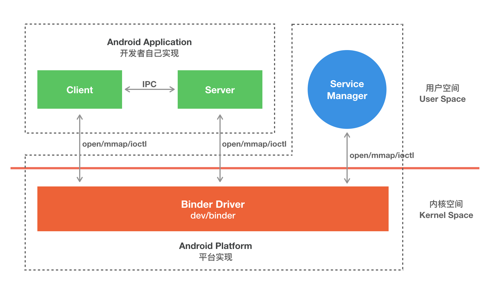

Android系统是基于Linux系统的，理论上应该使用Linux内置的IPC方式。Linux中的IPC方式有管道、Socket、信号量、共享内存、消息队列等，但Android却使用的Binder机制来解决IPC通信。

在Android中，Binder有两层含义：
- Binder是一种跨进程通信（IPC，Inter-Process Communication）的手段
- Binder是一种远程过程调用（RPC，Remote Procedure Call）的手段
- RPC强调的是调用，即一个进程直接调用另外一个进程中的方法，而IPC仅仅完成进程间的相互通信，没有函数调用功能

## Linux IPC
### 管道
### 共享内存
### Socket
### 信号量
### 消息队列

## Android Binder
Binder是基于C/S架构的。Binder框架定义了四个角色，包含Client、Server、ServiceManager以及Binder驱动，其中ServiceManager用于管理系统中的各种服务。Binder在framework层进行了封装，通过JNI技术调用Native（C/C++）层的 Binder架构，Binder在Native层以ioctl的方式与Binder驱动通讯。Client、Server、ServiceManager这三个存在于用户空间，Binder驱动处于内核空间。

### Binder驱动
Binder驱动工作于内核态，提供open()，mmap()，poll()，ioctl()等标准文件操作，用户通过/dev/binder访问。Binder驱动负责进程之间Binder通信的建立，Binder在进程之间的传递，Binder引用计数管理，数据包在进程之间的传递和交互等一系列底层支持。驱动和应用程序之间定义了一套接口协议，主要功能由ioctl()接口实现，不提供read()，write()接口，因为ioctl()灵活方便，且能够一次调用实现先写后读以满足同步交互，而不必分别调用write()和read()。

### ServiceManager与Server(实体Binder)
Server创建了Binder实体，并且为其定义一个可读易记的字符类型的名字，将这个Binder连同名字以数据包的形式通过Binder驱动发送给ServiceManager，ServiceManager收数据包后，从中取出名字和Binder的引用填入一张查找表中。

### Client获取Binder的引用
Server向ServiceManager注册了Binder实体及其名字后，Client就可以通过名字获得该Binder的引用了。从面向对象的角度，这个Binder对象现在有了两个引用：一个位于ServiceManager中，一个位于发起请求的Client中。如果接下来有更多的Client请求该Binder，系统中就会有更多的引用指向该Binder实体。

### 匿名Binder
不是所有Binder都需要注册给ServiceManager广而告之的。Server端可以通过已经建立的Binder连接将创建的Binder实体传给Client，当然这条已经建立的Binder连接必须是通过实名Binder实现。由于这个Binder没有向ServiceManager注册名字，这种实体Binder被称为匿名Binder。匿名Binder为通信双方建立一条私密通道，只要Server没有把匿名Binder发给别的进程，别的进程就无法通过穷举或猜测等任何方式获得该Binder的引用，向该Binder发送请求。

Binder的四个对象
IBInder
IInterface
Binder
Stub

AIDL
