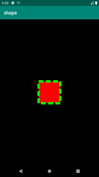

在Android开发中，可以使用shape定义各种各样的形状，也可以定义一些图片资源，这样做的好处是相对于传统图片来说，使用shape可以减少资源占用，减少安装包大小，还能够很好地适配不同尺寸的手机。

## Shape 基本使用
Shape可以定义控件的一些展示效果，例如圆角，渐变，填充，描边，大小，边距，主要有以下内容：

|标签名|说明|属性|属性说明|
|----|----|----|----|
|corners|圆角|android:radius|全部的圆角半径|
|||android:topLeftRadius|左上角圆角半径|
|||android:topRightRadius|右上角圆角半径|
|||android:bottomLeftRadius|左下角圆角半径|
|||android:bottomRightRadius|右下角圆角半径|
|gradient|渐变|android:type|渐变类型，"linear"/"radial"/"sweep"，线性渐变（默认）/放射渐变/扫描式渐变
|||android:angle|渐变角度，必须为45的倍数，0为从左到右，90为从上到下|
|||android:centerX|渐变中心X的相当位置，范围为0～1|
|||android:centerY|渐变中心Y的相当位置，范围为0～1|
|||android:startColor|渐变开始点的颜色|
|||android:centerColor|渐变中间点的颜色|
|||android:endColor|渐变结束点的颜色|
|||android:gradientRadius|渐变的半径，只有当渐变类型为radial时才有效|
|||android:useLevel|使用LevelListDrawable时就要设置为true。设为false时才有渐变效果|
|padding|内边距|android:left|左内边距|
|||android:top|上内边距|
|||android:right|右内边距|
|||android:bottom|下内边距|x1
|size|大小|android:width|图形的宽度|
|||android:height|图形的高度|
|solid|填充色|android:color|内部填充色|
|stroke|描边|android:width|描边的宽度|
|||android:color|描边的颜色|
|||android:dashWidth|虚线的宽度，如果为0则为实线|
|||android:dashGap|虚线的间隔|

Shape还可以定义当前Shape的形状的，有矩形，椭圆形，线形和环形。这些都是通过shape标签属性shape来定义的，对应的属性值分别rectangle，oval，line，ring，该值如果不设置，则默认值为rectangle。
``` xml
<?xml version="1.0" encoding="utf-8"?>
<shape xmlns:android="http://schemas.android.com/apk/res/android"
    android:shape=["rectangle" | "oval" | "line" | "ring"]
</shape>
```
当shape设置为“ring”，还可以额外使用一些属性：

|属性名|说明|
|---|---|
|android:innerRadius|内环半径|
|android:innerRadiusRatio|浮点型，以环的宽度比率来表示内环的半径|
|android:thickness|环的厚度|
|android:thicknessRatio|浮点型，以环的宽度比率来表示环的厚度|
|android:useLevel|如果当做是LevelListDrawable使用时值为true，否则为false|

### Shape 示例

```xml
<?xml version="1.0" encoding="utf-8"?>
<FrameLayout xmlns:android="http://schemas.android.com/apk/res/android"
    android:layout_width="match_parent"
    android:layout_height="match_parent"
    android:background="#000000">
    <ImageView
        android:layout_width="100dp"
        android:layout_height="100dp"
        android:layout_gravity="center"
        android:src="@drawable/shape" />
</FrameLayout>

<?xml version="1.0" encoding="utf-8"?>
<shape xmlns:android="http://schemas.android.com/apk/res/android">
    <corners
        android:bottomLeftRadius="5dp"
        android:bottomRightRadius="5dp"
        android:radius="10dp"
        android:topLeftRadius="5dp"
        android:topRightRadius="5dp" />
    <solid android:color="#ff0000" />
</shape>
```

```xml
<?xml version="1.0" encoding="utf-8"?>
<shape xmlns:android="http://schemas.android.com/apk/res/android">
    <gradient
        android:angle="45"
        android:type="linear"
        android:startColor="#ff0000"
        android:centerColor="#00ff00"
        android:endColor="#0000ff"
        android:useLevel="false" />
</shape>
```

```xml
<?xml version="1.0" encoding="utf-8"?>
<shape xmlns:android="http://schemas.android.com/apk/res/android">
    <stroke
        android:width="5dp"
        android:color="#00ff00"
        android:dashWidth="10dp"
        android:dashGap="5dp" />
    <solid android:color="#ff0000" />
</shape>
```

```xml
<?xml version="1.0" encoding="utf-8"?>
<shape xmlns:android="http://schemas.android.com/apk/res/android">
    <size
        android:width="50dp"
        android:height="50dp" />
    <stroke
        android:width="5dp"
        android:color="#00ff00"
        android:dashWidth="10dp"
        android:dashGap="5dp" />
    <solid android:color="#ff0000" />
</shape>
```

```xml
<?xml version="1.0" encoding="utf-8"?>
<shape xmlns:android="http://schemas.android.com/apk/res/android"
    android:shape="oval">
    <solid android:color="#FF0000"/>
</shape>
```

```xml
<?xml version="1.0" encoding="utf-8"?>
<shape xmlns:android="http://schemas.android.com/apk/res/android"
    android:shape="line">
    <stroke
        android:width="3dp"
        android:color="#ff0000"/>
</shape>
```

```xml
<?xml version="1.0" encoding="utf-8"?>
<shape xmlns:android="http://schemas.android.com/apk/res/android"
    android:shape="ring"
    android:useLevel="false"
    android:innerRadius="20dp"
    android:thickness="10dp">
    <solid android:color="#ff0000"/>
</shape>
```

```xml
<?xml version="1.0" encoding="utf-8"?>
<shape xmlns:android="http://schemas.android.com/apk/res/android"
    android:shape="ring"
    android:innerRadiusRatio="4"
    android:thicknessRatio="9"
    android:useLevel="false">
    <gradient
        android:startColor="#ff0000"
        android:endColor="#00000000"
        android:type="sweep"/>
</shape>
```

```xml
<?xml version="1.0" encoding="utf-8"?>
<shape xmlns:android="http://schemas.android.com/apk/res/android"
    android:shape="oval">
    <size
        android:width="40dp"
        android:height="40dp" />
    <gradient
        android:centerX="0.5"
        android:centerY="0.5"
        android:startColor="#ffff0000"
        android:centerColor="#80ff0000"
        android:endColor="#10ff0000"
        android:gradientRadius="30dp"
        android:type="radial" />
</shape>
```

