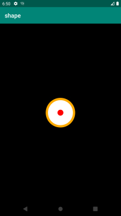
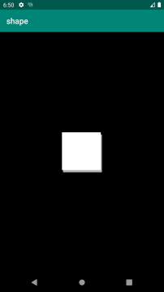

使用layer-list可以将多个drawable按照顺序层叠在一起显示，默认情况下，所有的item中的drawable都会自动根据它附上view的大小而进行缩放。layer-list中的item是按照顺序从下往上叠加的，即先定义的item在下面，后面的依次往上面叠放，每个item可以通过控制后添加图层距离最底部图层的左、上、右、下的四个边距等属性，来得到不同的显示效果。

```xml
<?xml version="1.0" encoding="utf-8"?>
<layer-list xmlns:android="http://schemas.android.com/apk/res/android">
    <item>
        <shape
            android:dither="true"
            android:shape="oval">
            <solid android:color="#ffffff" />
            <stroke
                android:width="2dp"
                android:color="#ffaa00" />
        </shape>
    </item>

    <item
        android:bottom="10dp"
        android:left="10dp"
        android:right="10dp"
        android:top="10dp">
        <shape android:shape="oval">
            <solid android:color="#ff0000" />
            <size
                android:width="5dp"
                android:height="5dp" />
        </shape>
    </item>
</layer-list >
```


```xml
<?xml version="1.0" encoding="utf-8"?>
<layer-list xmlns:android="http://schemas.android.com/apk/res/android">
    <item
        android:left="3dp"
        android:top="6dp">
        <shape>
            <solid android:color="#b4b5b6" />
        </shape>
    </item>

    <item
        android:bottom="6dp"
        android:right="3dp">
        <shape>
            <solid android:color="#fff" />
        </shape>
    </item>
</layer-list>
```

